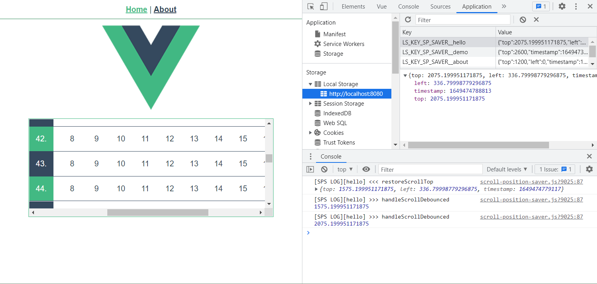

# ScrollPositionSaver

保存滚动位置的JS类。

```js
import {ScrollPositionSaver} from '@/utils/scroll-position-saver'
export default {
  mounted() {
    this.sps = new ScrollPositionSaver({
      name: 'demo',
      debug: true,
    })
  },
  beforeDestroy() {
    this.sps && this.sps.destroy()
  }
};
```



## Project setup
```
yarn install
```

### Compiles and hot-reloads for development
```
yarn serve
```

### Compiles and minifies for production
```
yarn build
```

### Customize configuration
See [Configuration Reference](https://cli.vuejs.org/config/).
